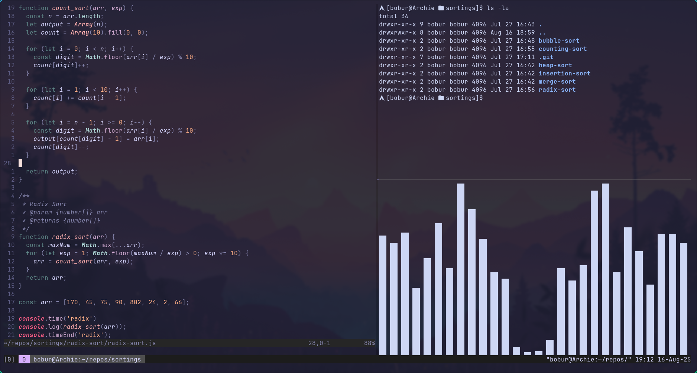

# My Arch - KDE/Hyprland setup 

This is my Arch KDE/Hyprland dev setup.

---

## Tools I use

- hypr
- waybar - navbar
- wofi - app launcher
- kitty - terminal
- alacritty - terminal
- nvim
- tmux

## Requirements

- Arch Linux (btw)
- Hyprland
- Wayland stuff (wlroots gang 🧪)
- Nerd Fonts
- `tmux`, `neovim`, `bash`, `kitty`, `alacritty`, `wofi`

## Setup

Just copy and paste inside .config under tool names

## Screenshots

